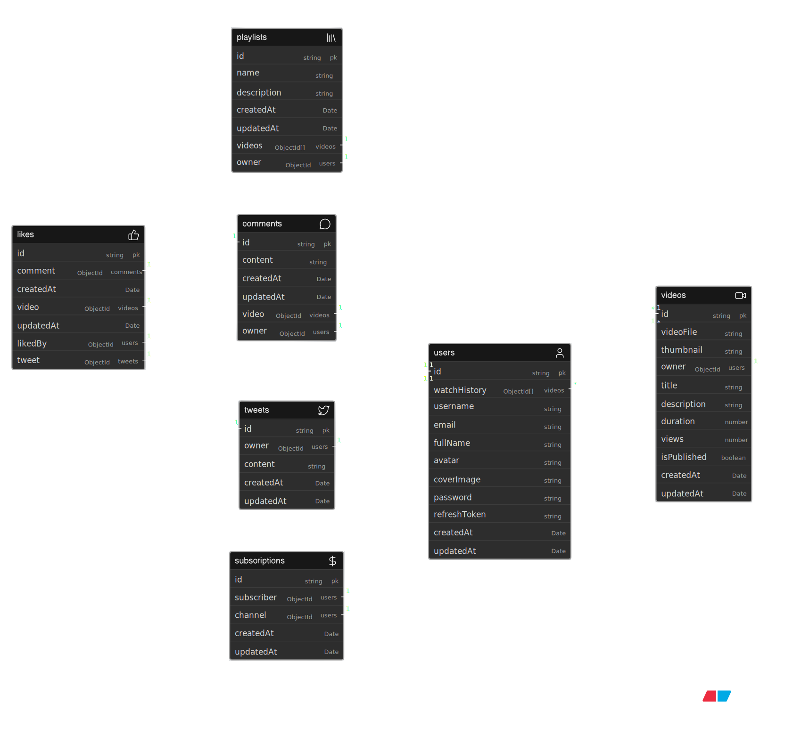
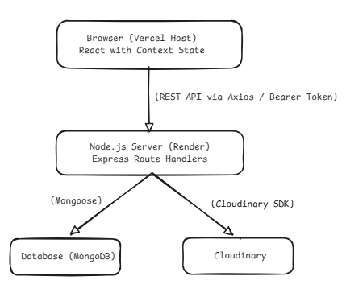

# 🎬 Strivo

<div align="center">

**A full-stack video platform with an integrated micro-blog social feed.**

<br />
<video src="https://github.com/Samarthpagaria/Strivo/raw/main/frontend/src/assets/video.mp4" controls="controls" muted="muted" width="100%"></video>
<br />

[](https://strivo.onrender.com)
[](https://strivo-app.vercel.app)
[](https://www.mongodb.com/atlas)
[](https://cloudinary.com)
[](https://umami.is)
[](https://cron-job.org)
[](https://opensource.org/licenses/ISC)
[](https://nodejs.org)
[](https://react.dev)

</div>

---

## 📖 Project Overview

**Strivo** is a full-stack content platform that merges long-form video hosting with a Twitter-style micro-blog feed — all in a single, unified experience. Think of it as YouTube and Twitter fused together: users can upload and manage videos, post short-form micro-posts (called "tweets" in the codebase), comment, like, subscribe to creators, and build curated playlists.

The platform solves the fragmentation problem faced by creators who must juggle separate tools for video content and social commentary. Strivo unifies both in one experience, with a smart home feed that blends content from subscribed channels with random discovery — giving new creators organic reach while keeping loyal followers engaged.

**Target users:** Independent content creators, niche community builders, and video enthusiasts who want a cleaner, full-featured alternative to mainstream video platforms without the algorithmic opacity.

**What makes Strivo unique?**
- Unified feed: Subscription videos + random discovery videos are shuffled together using Fisher-Yates, so every page load is fresh.
- Micro-blog layer: Creators can post tweet-style content (with image/video attachments and video mentions linking back to their Strivo videos) alongside their video content.
- Threaded comments on micro-posts (replies via `parentTweetId`) — a feature most standalone video platforms lack.
- Nested comment replies on videos (via `parent` field on comments).
- Transparent, open-source, no ad layer.

---

## 🌐 Live Links

| Service | URL |
|---------|-----|
| 🖥️ Frontend (Vercel) | https://strivo-app.vercel.app |
| ⚙️ Backend API (Render) | https://strivo.onrender.com |
| 📊 API Health Check | https://strivo.onrender.com/api/v1/healthcheck |

---

## 🛠️ Complete Tech Stack

### Backend (`backend/package.json`)

| Package | Version | Purpose | Configuration File |
|---------|---------|---------|-------------------|
| `express` | `^5.1.0` | Web framework (ESM) | `backend/src/app.js` |
| `mongoose` | `^8.19.2` | MongoDB ODM | `backend/src/db/index.js` |
| `mongoose-aggregate-paginate-v2` | `^1.1.4` | Cursor-based pagination for aggregation pipelines | `backend/src/models/video.models.js`, `comment.models.js` |
| `jsonwebtoken` | `^9.0.2` | JWT access & refresh token generation/verification | `backend/src/middlewares/auth.middleware.js` |
| `bcrypt` | `^6.0.0` | Password hashing (12 salt rounds) | `backend/src/models/user.models.js` |
| `cloudinary` | `^2.8.0` | Cloud media storage (video, image, thumbnail) | `backend/src/utils/cloudinary.js` |
| `multer` | `^2.0.2` | Multipart file upload handling (disk storage, 100 MB limit) | `backend/src/middlewares/multer.middleware.js` |
| `cors` | `^2.8.5` | Cross-Origin Resource Sharing | `backend/src/app.js` |
| `cookie-parser` | `^1.4.7` | HTTP cookie parsing (for JWT cookies) | `backend/src/app.js` |
| `dotenv` | `^17.2.3` | Environment variable loading | `backend/src/index.js` |
| `mongodb` | `^7.1.0` | Native MongoDB driver (peer dependency) | — |
| **devDependencies** | | | |
| `prettier` | `^3.6.2` | Code formatting | `backend/.prettierrc` |
| `nodemon` (implicit, run via npx) | — | Dev auto-restart | `npm run dev` |

**Backend Runtime:** Node.js with **ESM** (`"type": "module"`)

**Key Backend Architecture Notes:**
- Uses a top-level async IIFE in `index.js` to ensure `.env` is loaded before any module via dynamic imports — avoiding the ESM hoisting problem.
- Manually sets Google DNS (`8.8.8.8`, `8.8.4.4`, `1.1.1.1`) via `dns.setServers()` to resolve MongoDB SRV records reliably over IPv6 routers.
- Global error handler in `app.js` sends stack traces only in development mode.

---

### Frontend (`frontend/package.json`)

| Package | Version | Purpose |
|---------|---------|---------|
| `react` | `^19.2.0` | UI library |
| `react-dom` | `^19.2.0` | DOM renderer |
| `react-router-dom` | `^7.9.6` | Client-side routing |
| `axios` | `^1.13.2` | HTTP client for API calls |
| `@tanstack/react-query` | `^5.90.12` | Server state management, mutations, caching |
| `tailwindcss` | `^4.1.17` | Utility-first CSS |
| `@tailwindcss/vite` | `^4.1.17` | Tailwind v4 Vite plugin |
| `framer-motion` | `^12.23.25` | Animation library |
| `motion` | `^12.23.26` | Motion primitives |
| `gsap` | `^3.15.0` | Advanced animations (Landing page) |
| `lenis` | `^1.3.23` | Smooth scrolling |
| `@radix-ui/react-avatar` | `^1.1.11` | Accessible avatar primitive |
| `@radix-ui/react-label` | `^2.1.8` | Accessible label primitive |
| `@radix-ui/react-popover` | `^1.1.15` | Accessible popover primitive |
| `@radix-ui/react-separator` | `^1.1.8` | Accessible separator primitive |
| `@radix-ui/react-slot` | `^1.2.4` | Slot composition primitive |
| `lucide-react` | `^0.555.0` | Icon library |
| `@untitledui/icons` | `^0.0.19` | Additional icon set |
| `date-fns` | `^4.1.0` | Date formatting utilities |
| `canvas-confetti` | `^1.9.4` | Confetti animation effect |
| `class-variance-authority` | `^0.7.1` | Variant-driven component styling |
| `clsx` | `^2.1.1` | Conditional className utility |
| `tailwind-merge` | `^3.4.0` | Tailwind class conflict resolution |
| `react-intersection-observer` | `^10.0.0` | Intersection Observer hook |
| **devDependencies** | | |
| `vite` | `^7.2.4` | Build tool & dev server |
| `@vitejs/plugin-react` | `^5.1.1` | React Fast Refresh |
| `eslint` | `^9.39.1` | Linting |
| `@types/node` | `^24.10.1` | Node.js type definitions |
| `tw-animate-css` | `^1.4.0` | Tailwind animation utilities |

---

## 🗂️ Project Structure

```
strivo/
├── backend/
│   ├── src/
│   │   ├── index.js              # Entry point — DNS fix + ESM dynamic import chain
│   │   ├── app.js                # Express app, CORS config, route mounting, global error handler
│   │   ├── constants.js          # DB_NAME = "strivoDB"
│   │   ├── db/
│   │   │   └── index.js          # mongoose.connect() with MONGODB_URI + DB_NAME
│   │   ├── controllers/
│   │   │   ├── user.controllers.js        # Auth, profile, watch history
│   │   │   ├── videos.controllers.js      # Video CRUD, home feed, related videos
│   │   │   ├── tweets.controllers.js      # Tweet CRUD, home feed, following feed
│   │   │   ├── comment.controllers.js     # Threaded video comments
│   │   │   ├── likes.controllers.js       # Toggle likes (video/comment/tweet)
│   │   │   ├── subscription.controllers.js # Subscribe/unsubscribe, list subscribers
│   │   │   ├── playlist.controller.js     # Full playlist CRUD
│   │   │   ├── dashboard.controllers.js   # Channel stats (views, likes, subs, videos)
│   │   │   ├── healthcheck.controller.js  # Simple health check for uptime monitoring
│   │   │   └── sitestat.controller.js     # Global site upvote counter
│   │   ├── models/
│   │   │   ├── user.models.js       # User schema + bcrypt hooks + JWT methods
│   │   │   ├── video.models.js      # Video schema + aggregate paginate plugin
│   │   │   ├── tweet.models.js      # Micro-post schema (images, videos, mentions, replies)
│   │   │   ├── comment.models.js    # Threaded video comments + aggregate paginate
│   │   │   ├── like.models.js       # Polymorphic likes (video/comment/tweet)
│   │   │   ├── subscription.models.js # Subscriber <-> Channel relationship
│   │   │   ├── playlist.models.js   # User playlists with video references
│   │   │   └── sitestat.models.js   # Global upvote counter
│   │   ├── routes/
│   │   │   ├── user.routes.js
│   │   │   ├── videos.routes.js
│   │   │   ├── tweets.routes.js
│   │   │   ├── comment.routes.js
│   │   │   ├── likes.routes.js
│   │   │   ├── subscription.routes.js
│   │   │   ├── playlist.routes.js
│   │   │   ├── dashboard.routes.js
│   │   │   ├── healthcheck.routes.js
│   │   │   └── sitestats.routes.js
│   │   ├── middlewares/
│   │   │   ├── auth.middleware.js   # verifyJWT (hard) + softVerifyJWT (optional auth)
│   │   │   └── multer.middleware.js # Disk storage, 100 MB file size limit
│   │   └── utils/
│   │       ├── ApiError.js          # Custom error class
│   │       ├── ApiResponse.js       # Standardized response wrapper
│   │       ├── asyncHandler.js      # Async try/catch wrapper
│   │       └── cloudinary.js        # upload_large() with auto cleanup
│   ├── public/
│   │   └── temp/                    # Multer temp upload directory
│   ├── package.json
│   ├── .prettierrc
│   └── .env                         # (gitignored)
│
├── frontend/
│   ├── src/
│   │   ├── main.jsx               # React app entry point
│   │   ├── App.jsx                # Root component — context provider tree + RouterProvider
│   │   ├── App.css
│   │   ├── index.css              # Global styles + Tailwind
│   │   ├── ContentApi/            # All React Context providers
│   │   │   ├── AuthContext.jsx      # Login/register/logout mutations
│   │   │   ├── GlobalContext.jsx    # User, token, refreshToken global state
│   │   │   ├── VideoContext.jsx     # Video feed state
│   │   │   ├── VideoDetailContext.jsx # Single video detail state
│   │   │   ├── TweetContext.jsx     # Tweet feed state
│   │   │   ├── CommentContext.jsx   # Comment state per video
│   │   │   ├── PlaylistContext.jsx  # Playlist CRUD state
│   │   │   ├── myChannelContext.jsx # Channel dashboard state
│   │   │   ├── ProfileContext.jsx   # Channel profile state
│   │   │   ├── SearchContext.jsx    # Search query state
│   │   │   ├── SettingContext.jsx   # User settings state
│   │   │   └── ToastContext.jsx     # Toast notification state
│   │   ├── pages/
│   │   │   ├── Home.Page.jsx          # Home feed (videos)
│   │   │   ├── VideoDetails.Page.jsx  # Video player + comments + related
│   │   │   ├── ChannelProfile.jsx     # Public channel profile
│   │   │   ├── Subscriptions.Page.jsx # Following feed (tweets + videos)
│   │   │   ├── Playlists.Page.jsx     # User's playlists
│   │   │   ├── PlaylistDetail.Page.jsx# Single playlist view
│   │   │   ├── LikedVideos.Page.jsx   # User's liked videos
│   │   │   ├── LikedTweets.Page.jsx   # User's liked tweets
│   │   │   ├── WatchHistory.jsx       # Watch history
│   │   │   ├── Results.Page.jsx       # Search results
│   │   │   ├── Settings.Page.jsx      # Account settings
│   │   │   ├── Docs.Page.jsx          # In-app API documentation
│   │   │   ├── LandingPage.jsx        # Public landing page
│   │   │   ├── login.jsx              # Login page
│   │   │   ├── Register.jsx           # Register page
│   │   │   ├── Notifications.Page.jsx # Notifications (placeholder)
│   │   │   ├── Support.Page.jsx       # Support (placeholder)
│   │   │   ├── myChannel/             # My Channel dashboard
│   │   │   └── tweets/                # Tweet-related pages
│   │   ├── project_components/        # Shared UI components
│   │   │   ├── Header.jsx
│   │   │   ├── Sidebar.jsx
│   │   │   ├── VideoCard.jsx
│   │   │   ├── VideoDetailSidebar.jsx
│   │   │   ├── Tweet.jsx
│   │   │   ├── TweetPost.jsx
│   │   │   ├── PublishVideoModal.jsx
│   │   │   ├── PlaylistCard.jsx
│   │   │   ├── SubscribeButton.jsx
│   │   │   ├── SignupForm.jsx
│   │   │   ├── Toast.jsx
│   │   │   ├── UmamiTracker.jsx       # Umami page-view tracker
│   │   │   ├── PixelCard.jsx
│   │   │   ├── Confetti.jsx
│   │   │   └── ...more components
│   │   ├── components/
│   │   │   ├── login-form.jsx
│   │   │   └── ui/                    # Radix UI-based primitives
│   │   ├── Layouts/
│   │   │   ├── RootLayout.jsx         # Main layout (sidebar + header)
│   │   │   ├── AuthLayout.jsx         # Auth pages layout
│   │   │   └── TweetsLayout.jsx       # Tweets section layout
│   │   ├── route/
│   │   │   └── router.jsx             # React Router v7 browser router config
│   │   ├── lib/                       # Shared utilities (cn helper, etc.)
│   │   ├── assets/                    # Static assets (logo, images)
│   │   └── utils/
│   │       ├── PrivateRoute.jsx       # Auth guard wrapper
│   │       └── mockData.js            # Development mock data
│   ├── index.html                     # HTML entry + Umami script tag
│   ├── vite.config.js                 # Vite config (@ alias, Tailwind plugin)
│   ├── package.json
│   ├── eslint.config.js
│   └── .env                           # VITE_API_URL
│
└── README.md
```

---

## 🗄️ Database Structure

Hover over each collection card to reveal the structured properties (all password references and sensitive data keys are strictly hidden for complete privacy).



**Database Name:** `strivoDB` (defined in `backend/src/constants.js`)

### User Model (`backend/src/models/user.models.js`)

```javascript
{
  username:     { type: String, required: true, unique: true, lowercase: true, trim: true, index: true },
  email:        { type: String, required: true, unique: true, lowercase: true, trim: true },
  fullName:     { type: String, required: true, index: true, trim: true },
  avatar:       { type: String, required: true },         // Cloudinary URL
  coverImage:   { type: String },                          // Cloudinary URL (optional)
  watchHistory: [{ type: ObjectId, ref: "Video" }],       // Ordered, most recent first
  password:     { type: String, required: true },          // bcrypt hashed, 12 rounds
  refreshToken: { type: String },                          // Stored for token rotation validation
}
// timestamps: true
```

**Pre-save hook:** Hashes password with bcrypt (12 rounds) only if modified.

**Instance Methods:**
- `isPasswordCorrect(password)` — bcrypt.compare
- `generateAccessToken()` — JWT signed with `ACCESS_TOKEN_SECRET`, expiry from `ACCESS_TOKEN_EXPIRY`
- `generateRefreshToken()` — JWT signed with `REFRESH_TOKEN_SECRET`, expiry from `REFRESH_TOKEN_EXPIRY`

---

### Video Model (`backend/src/models/video.models.js`)

```javascript
{
  videoFile:   { type: String, required: true },    // Cloudinary URL
  thumbnail:   { type: String, required: true },    // Cloudinary URL
  title:       { type: String, required: true },
  description: { type: String, required: true },
  duration:    { type: Number, required: true },    // Sourced from Cloudinary response
  views:       { type: Number, default: 0 },        // Incremented on getVideo()
  isPublished: { type: Boolean, default: true },    // Toggle publish/unpublish
  owner:       { type: ObjectId, ref: "User" },
}
// timestamps: true
// Plugin: mongooseAggregatePaginate
```

---

### Tweet Model — Micro-Post (`backend/src/models/tweet.models.js`)

```javascript
{
  owner:         { type: ObjectId, ref: "User" },
  content:       { type: String, required: true },
  images:        { type: [String] },                        // Cloudinary URLs (max 4)
  videos:        { type: [String] },                        // Cloudinary URLs (max 3)
  videoMention:  { type: ObjectId, ref: "Video" },          // Optional: link to a Strivo video
  parentTweetId: { type: ObjectId, ref: "Tweet", default: null }, // For threaded replies
}
// timestamps: true
```

> ℹ️ Replies to tweets use `parentTweetId` — the same `Tweet` collection handles both posts and comments (self-referential tree).

---

### Comment Model (`backend/src/models/comment.models.js`)

```javascript
{
  content: { type: String, required: true },
  video:   { type: ObjectId, ref: "Video", required: true },
  owner:   { type: ObjectId, ref: "User", required: true },
  parent:  { type: ObjectId, ref: "Comment", default: null }, // For nested replies
}
// timestamps: true
// Plugin: mongooseAggregatePaginate
```

---

### Like Model (`backend/src/models/like.models.js`)

Polymorphic — a single document represents a like on any content type:

```javascript
{
  video:   { type: ObjectId, ref: "Video", default: null },
  comment: { type: ObjectId, ref: "Comment", default: null },
  tweet:   { type: ObjectId, ref: "Tweet", default: null },
  likedBy: { type: ObjectId, ref: "User", required: true },
}
// timestamps: true
```

---

### Subscription Model (`backend/src/models/subscription.models.js`)

```javascript
{
  subscriber: { type: ObjectId, ref: "User", required: true }, // Who is subscribing
  channel:    { type: ObjectId, ref: "User", required: true }, // Who is being subscribed to
}
// timestamps: true
```

---

### Playlist Model (`backend/src/models/playlist.models.js`)

```javascript
{
  name:        { type: String, required: true },
  description: { type: String },
  videos:      [{ type: ObjectId, ref: "Video" }],   // Ordered video references
  owner:       { type: ObjectId, ref: "User", required: true },
}
// timestamps: true
```

---

### SiteStat Model (`backend/src/models/sitestat.models.js`)

```javascript
{
  upvotes: { type: Number, default: 0 }, // Global site upvote counter (single document)
}
// timestamps: true
```

---

## 🔐 Authentication & Security

### Authentication Flow

**Registration** (`POST /api/v1/users/register`):
1. Validate `fullName`, `email`, `username`, `password` (all required, non-empty).
2. Check for existing user by email or username — throw `409` if found.
3. Upload `avatar` (required) and `coverImage` (optional) via Multer → Cloudinary.
4. Create user document; password is hashed automatically by Mongoose pre-save hook (bcrypt, 12 rounds).
5. Generate both access and refresh tokens → auto-login on register.
6. Set `accessToken` + `refreshToken` as HTTP-only cookies.
7. Return user object + tokens in response body.

**Login** (`POST /api/v1/users/login`):
1. Accept `email` OR `username` + `password`.
2. Find user, compare password with bcrypt.
3. Generate access + refresh tokens, store refresh token in DB.
4. Set cookies + return tokens in body.

**Token Refresh** (`POST /api/v1/users/refresh-token`):
1. Read refresh token from cookie or request body.
2. Verify JWT, find user, validate token matches stored value.
3. Rotate: issue new access + refresh tokens.

**Logout** (`POST /api/v1/users/logout`):
1. Unset `refreshToken` field on user document (`$unset`).
2. Clear both cookies.

### Cookie Settings

```javascript
{
  httpOnly: true,   // Not accessible via JS
  secure: true,     // HTTPS only
  sameSite: "None", // Required for cross-site requests (Vercel <-> Render)
}
```

### Auth Middleware

Two variants in `backend/src/middlewares/auth.middleware.js`:

| Middleware | Behavior |
|-----------|---------|
| `verifyJWT` | Hard auth — throws `401` if no valid token |
| `softVerifyJWT` | Optional auth — attaches `req.user` if token is valid, proceeds without error if not present |

Token is read from `req.cookies.accessToken` OR `Authorization: Bearer <token>` header.

### Security Notes

- **No helmet**: Not implemented.
- **No rate limiting**: Not implemented.
- **No input validation library**: Validation is manual (field presence + trim checks).
- **No XSS / MongoDB injection middleware**: Not implemented (Mongoose sanitizes ObjectId validation).
- **File upload**: 100 MB limit per file enforced by Multer.
- **Temp file cleanup**: Files in `public/temp/` are deleted after successful Cloudinary upload (and also on upload failure).
- **Password field**: Excluded from queries via `.select("-password -refreshToken")`.
- **CORS**: Whitelist-based — allows `process.env.CORS_ORIGIN`, `http://localhost:5173`, `https://strivo-app.vercel.app`.

---

## 📡 Complete API Reference

**Base URL:** `https://strivo.onrender.com`

**API Version Prefix:** `/api/v1`

**Standard Response Shape:**
```json
{
  "statusCode": 200,
  "data": { },
  "message": "Success message",
  "success": true
}
```

---

### 🔑 User Routes (`/api/v1/users`)

| Method | Endpoint | Auth | Description |
|--------|----------|------|-------------|
| `POST` | `/register` | ❌ | Register new user (multipart: avatar required, coverImage optional) |
| `POST` | `/login` | ❌ | Login with email/username + password |
| `POST` | `/logout` | ✅ | Logout, clear cookies, unset refreshToken |
| `POST` | `/refresh-token` | ❌ | Rotate access + refresh tokens |
| `POST` | `/change-password` | ✅ | Change password (requires old + new password) |
| `GET` | `/current-user` | ✅ | Get currently authenticated user |
| `PATCH` | `/update-account` | ✅ | Update fullName and email |
| `PATCH` | `/avatar` | ✅ | Update avatar image (multipart: `avatar`) |
| `PATCH` | `/cover-image` | ✅ | Update cover image (multipart: `coverImage`) |
| `GET` | `/c/:username` | ✅ | Get channel profile by username (with subscriber count + isSubscribed) |
| `GET` | `/history` | ✅ | Get watch history (ordered, most recent first) |
| `DELETE` | `/history` | ✅ | Clear watch history |

**Register Request (multipart/form-data):**
```
fullName, email, username, password  <- text fields
avatar                                <- file (required)
coverImage                            <- file (optional)
```

**Register Response:**
```json
{
  "data": {
    "user": { "_id": "...", "fullName": "...", "username": "...", "email": "...", "avatar": "...", "coverImage": "..." },
    "accessToken": "...",
    "refreshToken": "..."
  }
}
```

---

### 🎬 Video Routes (`/api/v1/videos`)

| Method | Endpoint | Auth | Description |
|--------|----------|------|-------------|
| `GET` | `/` | Optional (`softVerifyJWT`) | Get all videos with search, sort, pagination |
| `POST` | `/` | ✅ | Upload/publish a new video |
| `GET` | `/home-feed` | ✅ | Get personalized home feed (subscribed + random) |
| `GET` | `/related/:videoId` | ❌ | Get related videos (same owner + random) |
| `GET` | `/:videoId` | Optional (`softVerifyJWT`) | Get video by ID (increments views, updates watch history) |
| `PATCH` | `/:videoId` | ✅ | Update video metadata (title, description, thumbnail) |
| `DELETE` | `/:videoId` | ✅ | Delete video (owner only) |
| `PATCH` | `/toggle/publish/:videoId` | ✅ | Toggle video publish/unpublish status |

**GET `/` Query Parameters:**
```
page     (default: 1)
limit    (default: 10)
query    (search in title + description, case-insensitive)
sortBy   (default: "createdAt")
sortType (default: "desc", options: "asc"/"desc")
userId   (filter by owner; owner can see unpublished videos of themselves)
```

**POST `/` (Upload Video) — multipart/form-data:**
```
videoFile   <- file (required)
thumbnail   <- file (required)
title       <- text (required)
description <- text (required)
```

**Home Feed Algorithm:**
1. Fetch up to 20 most recent videos from subscribed channels.
2. Fetch 30 random published videos.
3. Exclude subscribed videos from the random pool.
4. Combine and shuffle using **Fisher-Yates** algorithm.

**Related Videos Algorithm:**
1. Fetch up to 5 random videos from same owner (excluding current video).
2. Fill remaining slots (up to 10 total) with random videos from any creator.
3. Combine and shuffle using **Fisher-Yates** algorithm.

---

### 🐦 Tweet Routes — Micro-Posts (`/api/v1/tweets`)

| Method | Endpoint | Auth | Description |
|--------|----------|------|-------------|
| `POST` | `/` | ✅ | Create tweet (multipart: images max 4, videos max 3) |
| `GET` | `/feed` | ✅ | Get home feed tweets (subscribed + random, shuffled) |
| `GET` | `/following` | ✅ | Get tweets from followed channels only |
| `GET` | `/comments/:tweetId` | ✅ | Get replies to a specific tweet |
| `GET` | `/user/:userId` | ✅ | Get all tweets by a user |
| `PATCH` | `/:tweetId` | ✅ | Update tweet content (owner only) |
| `DELETE` | `/:tweetId` | ✅ | Delete tweet (owner only) |

**POST `/` (Create Tweet) — multipart/form-data:**
```
content        <- text (required)
videoMention   <- text (optional, ObjectId of Strivo video to link)
parentTweetId  <- text (optional, ObjectId for threading replies)
images         <- files (optional, max 4)
videos         <- files (optional, max 3)
```

**Tweet Feed Algorithm:** Same Fisher-Yates blend as video feed — subscribed authors' tweets + random discovery tweets.

---

### 💬 Comment Routes (`/api/v1/comments`)

| Method | Endpoint | Auth | Description |
|--------|----------|------|-------------|
| `GET` | `/:videoId` | ✅ | Get video comments (paginated, with reply counts + likes) |
| `POST` | `/:videoId` | ✅ | Add comment to video (supports `parent` for nested replies) |
| `DELETE` | `/c/:commentId` | ✅ | Delete comment (owner only) |
| `PATCH` | `/c/:commentId` | ✅ | Update comment content (owner only) |

**GET `/:videoId` Query Parameters:**
```
page    (default: 1)
limit   (default: 10)
parent  (optional ObjectId — if provided, returns replies to that comment; if omitted, returns root comments only)
```

---

### ❤️ Like Routes (`/api/v1/likes`)

All like operations are **toggle** — calling the endpoint again undoes the like.

| Method | Endpoint | Auth | Description |
|--------|----------|------|-------------|
| `POST` | `/toggle/v/:videoId` | ✅ | Toggle like on video |
| `POST` | `/toggle/c/:commentId` | ✅ | Toggle like on comment |
| `POST` | `/toggle/t/:tweetId` | ✅ | Toggle like on tweet |
| `GET` | `/videos` | ✅ | Get all videos liked by current user |
| `GET` | `/tweets` | ✅ | Get all tweets liked by current user |

---

### 📡 Subscription Routes (`/api/v1/subscriptions`)

| Method | Endpoint | Auth | Description |
|--------|----------|------|-------------|
| `POST` | `/c/:channelId` | ✅ | Toggle subscribe/unsubscribe to channel |
| `GET` | `/c/:channelId` | ✅ | Get subscribers list + count for a channel |
| `GET` | `/u/:subscriberId` | ✅ | Get channels a user is subscribed to |

---

### 🎵 Playlist Routes (`/api/v1/playlist`)

| Method | Endpoint | Auth | Description |
|--------|----------|------|-------------|
| `POST` | `/` | ✅ | Create playlist (name required, description optional) |
| `GET` | `/:playlistId` | ✅ | Get playlist by ID (with full video + owner details) |
| `PATCH` | `/:playlistId` | ✅ | Update playlist name/description (owner only) |
| `DELETE` | `/:playlistId` | ✅ | Delete playlist (owner only) |
| `PATCH` | `/add/:videoId/:playlistId` | ✅ | Add video to playlist (`$addToSet` — no duplicates) |
| `PATCH` | `/remove/:videoId/:playlistId` | ✅ | Remove video from playlist |
| `GET` | `/user/:userId` | ✅ | Get all playlists by a user |

---

### 📊 Dashboard Routes (`/api/v1/dashboard`)

| Method | Endpoint | Auth | Description |
|--------|----------|------|-------------|
| `GET` | `/stats` | ✅ | Get channel analytics: total_videos, total_subscribers, total_following, total_views, total_likes |
| `GET` | `/videos` | ✅ | Get all videos uploaded by authenticated channel |

---

### 🏥 Health Check Route (`/api/v1/healthcheck`)

| Method | Endpoint | Auth | Description |
|--------|----------|------|-------------|
| `GET` | `/` | ❌ | Returns OK — used by uptime cron-job |

**Response:**
```json
{
  "statusCode": 200,
  "data": "OK",
  "message": "Service is healthy",
  "success": true
}
```

---

### 🗳️ Site Stats Routes (`/api/v1/sitestats`)

| Method | Endpoint | Auth | Description |
|--------|----------|------|-------------|
| `GET` | `/` | ❌ | Get global upvote count |
| `POST` | `/increment` | ❌ | Increment global upvote count by 1 |

---

## 🚀 Deployment Stack

### Backend — Render

| Property | Value |
|----------|-------|
| **Platform** | [Render](https://render.com) |
| **Service URL** | `https://strivo.onrender.com` |
| **Runtime** | Node.js |
| **Start Command** | `node src/index.js` |
| **Plan** | Free tier (spins down after inactivity) |

### Frontend — Vercel

| Property | Value |
|----------|-------|
| **Platform** | [Vercel](https://vercel.com) |
| **App URL** | `https://strivo-app.vercel.app` |
| **Build Command** | `vite build` |
| **Output Directory** | `dist` |
| **Framework Preset** | Vite |

### Database — MongoDB Atlas

| Property | Value |
|----------|-------|
| **Platform** | [MongoDB Atlas](https://www.mongodb.com/atlas) |
| **Database Name** | `strivoDB` |
| **Connection** | `MONGODB_URI` env var with SRV string |

### Media — Cloudinary

| Property | Value |
|----------|-------|
| **Platform** | [Cloudinary](https://cloudinary.com) |
| **Upload Method** | `upload_large()` with `resource_type: "auto"` |
| **Cleanup** | Temp files deleted from `public/temp/` after upload (success or failure) |

---

## ⏰ Uptime Monitoring — Cron-Job

Render's free tier spins down after periods of inactivity. A cron-job is configured to ping the health check endpoint regularly to keep the backend alive.

| Property | Value |
|----------|-------|
| **Service** | [cron-job.org](https://cron-job.org) |
| **Ping URL** | `https://strivo.onrender.com/api/v1/healthcheck` |
| **Method** | `GET` |
| **Expected Response** | `200 OK` |
| **Recommended Frequency** | Every 14 minutes |
| **Purpose** | Prevent Render free-tier cold starts |

> The health check endpoint is implemented in `backend/src/controllers/healthcheck.controller.js` and mounted at `/api/v1/healthcheck`.

**No scheduled/background jobs** are implemented in application code — no database cleanup, no cache invalidation, no email queues.

---

## 📈 Umami Analytics

Strivo uses [Umami](https://umami.is) for privacy-friendly, cookie-less analytics.

### Script Integration (`frontend/index.html`)

```html
<script
  defer
  src="https://cloud.umami.is/script.js"
  data-website-id="[REDACTED]"
></script>
```

| Property | Value |
|----------|-------|
| **Instance** | Umami Cloud (`cloud.umami.is`) |
| **Script URL** | `https://cloud.umami.is/script.js` |
| **Integration Point** | `frontend/index.html` (global, loads on all pages) |

### Page-View Tracking Component (`frontend/src/project_components/UmamiTracker.jsx`)

```jsx
import { useEffect } from "react";
import { useLocation } from "react-router-dom";

const UmamiTracker = () => {
  const location = useLocation();

  useEffect(() => {
    if (window.umami) {
      window.umami.track(); // Track page view on every route change
    }
  }, [location.pathname]);

  return null;
};
```

This component fires `window.umami.track()` on every client-side navigation (React Router route change), ensuring single-page app navigation is properly tracked.

**Custom Analytics Events:** No custom event tracking (beyond page views) is implemented in the current codebase. No calls to `window.umami.track(eventName, data)` exist in the source.

---

## 🏗️ Architecture Deep Dive

### High-Level Flow Diagram


### Cold-Start Mitigation
To combat Render’s free-tier container sleep cycle, the frontend landing page fires a `GET /api/v1/healthcheck` warm-up ping immediately on mounting, ensuring a fast sign-in response for incoming users.

### Media Upload Pipeline
Video uploads use a Multer-to-Cloudinary staging model. Client files hit `POST /api/v1/videos`, get stored temporarily under `./public/temp/`, and are immediately pushed to Cloudinary via `cloudinary.uploader.upload_large`. The temp local files are cleared synchronously immediately after, ensuring zero server storage bloat.

### Discover Feed
To keep the video and micro-post feeds engaging and stable, the backend implements a randomized discovery model utilizing the Fisher-Yates shuffle algorithm on compiled subscriptions and public videos.

**File Limits:**
- Max file size: **100 MB** per file (set in `multer.middleware.js`)
- No client-side file type filtering in the Multer config (Cloudinary accepts `resource_type: "auto"`)
- Duration is automatically sourced from Cloudinary's response object.

**Thumbnail:** Manually uploaded by the user (not auto-generated by Cloudinary).

### Authentication State (Frontend)

Tokens are persisted in **`localStorage`** and **`sessionStorage`**:

```javascript
localStorage.setItem("user", JSON.stringify(data.data.user));
localStorage.setItem("accessToken", data.data.accessToken);
localStorage.setItem("refreshToken", data.data.refreshToken);
sessionStorage.setItem("sessionActive", "true");
```

Logout clears all of the above. Cookies are also cleared server-side. Axios requests use `withCredentials: true` for cookie transmission.

### State Management Architecture (Frontend)

React Context API with `@tanstack/react-query` for server state:

| Context | Responsibility |
|---------|----------------|
| `GlobalContext` | User object, access token, refresh token |
| `AuthContext` | Login, register, logout mutations |
| `VideoContext` | Video feed list |
| `VideoDetailContext` | Single video detail + related state |
| `TweetContext` | Tweet feed, create/delete mutations |
| `CommentContext` | Comments per video |
| `PlaylistContext` | Playlist CRUD |
| `myChannelContext` | Channel dashboard stats + videos |
| `SearchContext` | Search query string |
| `SettingContext` | Account settings mutations |
| `ToastContext` | Global toast notifications |

---

## ⚙️ Environment Variables

### Backend (`.env`)

```bash
# Server
PORT=8000                          # Default port (falls back to 8000 if not set)
NODE_ENV=development               # "development" or "production"

# Database
MONGODB_URI=mongodb+srv://...      # MongoDB Atlas connection string (without DB name)

# JWT
ACCESS_TOKEN_SECRET=<secret>       # Secret for signing access JWTs
ACCESS_TOKEN_EXPIRY=<duration>     # e.g., "1d", "15m"
REFRESH_TOKEN_SECRET=<secret>      # Secret for signing refresh JWTs
REFRESH_TOKEN_EXPIRY=<duration>    # e.g., "10d"

# Cloudinary
CLOUDINARY_CLOUD_NAME=<name>
CLOUDINARY_API_KEY=<key>
CLOUDINARY_API_SECRET=<secret>

# CORS
CORS_ORIGIN=https://strivo-app.vercel.app  # Additional CORS origin
```

### Frontend (`.env`)

```bash
VITE_API_URL=https://strivo.onrender.com   # Backend base URL
```

> ⚠️ All `.env` files are gitignored. Never commit secrets.

---

## 📜 Scripts

### Backend (`backend/package.json`)

```json
{
  "start": "node src/index.js",
  "dev": "nodemon src/index.js"
}
```

> No `test`, `lint`, `seed`, or `build` scripts are defined.

### Frontend (`frontend/package.json`)

```json
{
  "dev":     "vite",
  "build":   "vite build",
  "lint":    "eslint .",
  "preview": "vite preview"
}
```

---

## 🖥️ Pages & Routes (Frontend)

| Path | Component | Auth Required | Description |
|------|-----------|--------------|-------------|
| `/` | `Home.Page.jsx` | ❌ | Home video feed |
| `/watch/:videoId` | `VideoDetails.Page.jsx` | ❌ | Video player + comments + related |
| `/subscriptions` | `Subscriptions.Page.jsx` | ✅ | Following feed (videos + tweets) |
| `/playlists` | `Playlists.Page.jsx` | ✅ | User's playlists |
| `/playlists/:playlistId` | `PlaylistDetail.Page.jsx` | ✅ | Single playlist |
| `/liked_videos` | `LikedVideos.Page.jsx` | ✅ | Liked videos |
| `/liked_tweets` | `LikedTweets.Page.jsx` | ✅ | Liked tweets |
| `/history` | `WatchHistory.jsx` | ✅ | Watch history |
| `/results` | `Results.Page.jsx` | ❌ | Search results |
| `/c/:username` | `ChannelProfile.jsx` | ✅ | Public channel profile |
| `/channel` | `myChannelProfile` | ✅ | My channel dashboard |
| `/settings` | `Settings.Page.jsx` | ✅ | Account settings |
| `/docs` | `Docs.Page.jsx` | ❌ | In-app API documentation |
| `/support` | `Support.Page.jsx` | ❌ | Support (placeholder) |
| `/notifications` | `Notifications.Page.jsx` | ❌ | Notifications (placeholder) |
| `/login` | `login.jsx` | ❌ | Login |
| `/register` | `Register.jsx` | ❌ | Register |

---

## ⚠️ Known Limitations & Missing Features

### Technical Limitations

- **File size:** 100 MB cap per upload (Multer limit).
- **No file type filtering:** Multer config does not restrict MIME types — Cloudinary handles format validation.
- **No rate limiting:** No `express-rate-limit` or similar middleware.
- **No security headers:** `helmet` is not used.
- **No input validation library:** Validation is manual field-presence checks only.
- **No real-time features:** No WebSockets or Server-Sent Events — all feeds are request/response.
- **No caching layer:** No Redis, in-memory cache, or CDN caching headers.
- **No email service:** No email verification, password reset via email, or notifications.
- **No background job queue:** No Bull, BullMQ, Agenda, or similar.
- **No test suite:** No Jest, Vitest, or any test files exist.
- **No admin dashboard:** No admin roles or content moderation tools.
- **Cloudinary cleanup (avatar/cover):** Old avatar/cover images are **not deleted** from Cloudinary when updated (noted as a TODO in `user.controllers.js`).
- **Cloudinary cleanup (video delete):** Cloudinary files are **not deleted** when a video is deleted from DB (noted as skipped in `videos.controllers.js`).
- **Home feed limit:** Random video pool is capped at 30; subscribed videos capped at 20 — no true infinite scroll beyond initial pool.

### Feature Gaps

- No search for tweets/micro-posts (only video search is implemented).
- Notifications page is a placeholder — no notification system.
- Support page is a placeholder.
- No user block/mute functionality.
- No content reporting system.
- No playlist privacy setting (all playlists are effectively public via the API).
- Comment likes are tracked but there's no endpoint to get liked comments.
- No video tags/categories implemented (schema does not include tags or category fields).

---

## 🔧 Local Development Setup

### Prerequisites

- Node.js >= 18
- MongoDB Atlas account (or local MongoDB)
- Cloudinary account

### Backend Setup

```bash
cd backend
npm install

# Create .env file with all required variables (see Environment Variables section)

# Start dev server
npm run dev
# Server runs on http://localhost:8000
```

### Frontend Setup

```bash
cd frontend
npm install

# Create .env file:
# VITE_API_URL=http://localhost:8000

npm run dev
# App runs on http://localhost:5173
```

### Build for Production

```bash
# Frontend
cd frontend
npm run build
# Output: frontend/dist/

# Backend (no build step — runs directly with Node.js ESM)
npm start
```

---

## 🤝 Contributing

### Code Style

- **Backend:** Prettier is configured (`backend/.prettierrc`). Run `npx prettier --write .` before committing.
- **Frontend:** ESLint with `eslint-plugin-react-hooks` and `eslint-plugin-react-refresh`. Run `npm run lint` to check.

### Development Notes

- Always use `verifyJWT` or `softVerifyJWT` middleware for protected routes — never expose user-specific data without auth.
- Use `asyncHandler` wrapper for all controller functions to propagate errors to the global error handler.
- Use `ApiError` and `ApiResponse` utilities for consistent response shapes.
- All media uploads go through `uploadOnCloudinary()` in `backend/src/utils/cloudinary.js`.

---

## 📄 License

ISC — see [package.json](backend/package.json).

---

## 👤 Author

**Samarth Pagaria**

- GitHub: [@Samarthpagaria](https://github.com/Samarthpagaria)
- Repo: [github.com/Samarthpagaria/Strivo](https://github.com/Samarthpagaria/Strivo)
- Issues: [github.com/Samarthpagaria/Strivo/issues](https://github.com/Samarthpagaria/Strivo/issues)
