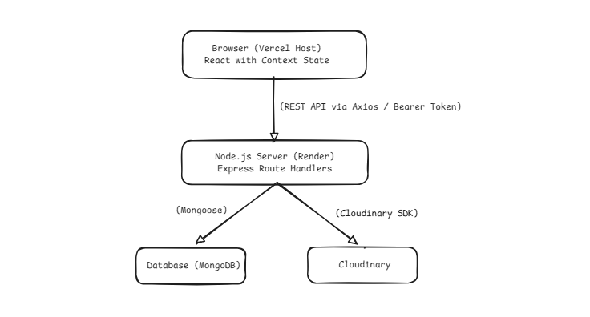
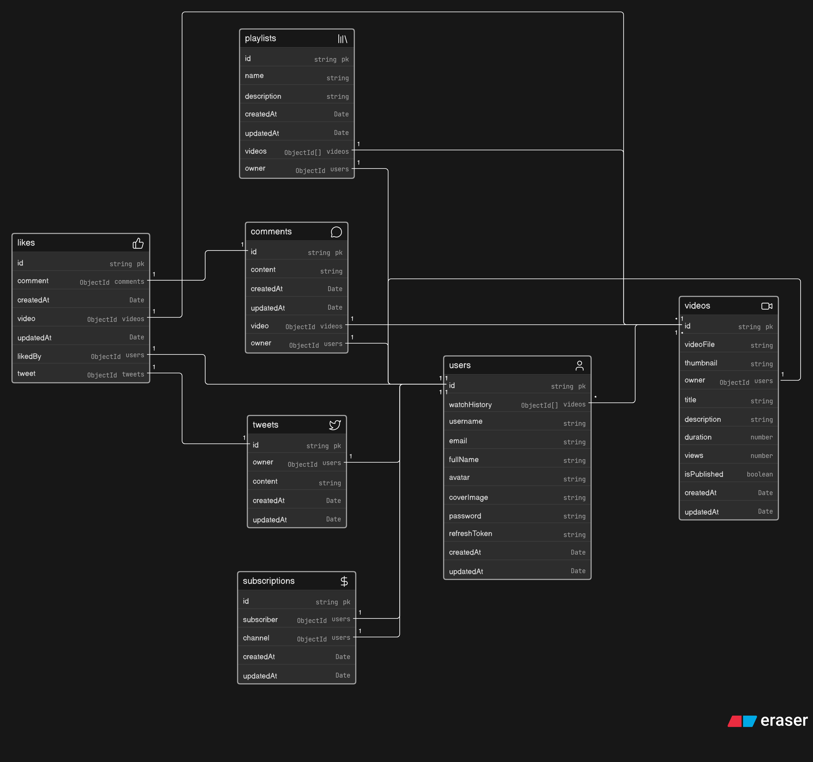

<div align="center">

# 🎬 Strivo

**A unified video-sharing and micro-blogging platform — where content meets conversation.**

[](https://strivo-app.vercel.app)
[](https://render.com)
[](https://www.mongodb.com/atlas)
[](LICENSE)

</div>

---

## 📌 Overview

Strivo is a full-stack, video-centric social platform that unifies rich media playback and real-time micro-blogging into a single seamless interface. Users can upload and stream videos, interact through likes and comments, manage playlists, and participate in short-form discussions — all without ever switching apps.

---

## ✨ Features

- **📹 Video Upload & Playback** — Upload videos with auto-generated thumbnails; stream with metadata and visibility controls
- **🔍 Personalized Discovery** — Randomized feed using the Fisher-Yates shuffle algorithm across subscriptions and public content
- **💬 Micro-Post Feed** — Integrated side feed for short-form updates, discussions, and video mentions — like a built-in Twitter
- **❤️ Reactions & Comments** — Toggle likes on videos, posts, and comments; nested comment threads per video
- **📂 Playlists** — Create, manage, and reorder custom watch playlists
- **🔔 Subscriptions** — Subscribe to channels and receive tailored home feed updates
- **📊 Creator Dashboard** — Aggregate channel stats and analytics via dedicated dashboard endpoints
- **🔐 Secure Auth** — Dual JWT strategy (access + refresh tokens) with httpOnly cookies
- **⚡ Cold-Start Mitigation** — Frontend fires a `/healthcheck` ping on mount to pre-warm the Render backend instance
- **☁️ Cloud Media Pipeline** — Multer → temp storage → Cloudinary upload → auto-cleanup; zero server storage bloat

---

## 🛠️ Tech Stack

| Layer                | Technology                                                   |
| -------------------- | ------------------------------------------------------------ |
| **Frontend**         | React + Vite                                                 |
| **Styling**          | Tailwind CSS (`@tailwindcss/vite`)                           |
| **State Management** | React Context API (domain-separated providers)               |
| **Data Fetching**    | TanStack React Query + Axios                                 |
| **Routing**          | React Router DOM (`createBrowserRouter`)                     |
| **Animation**        | Framer Motion + GSAP + Lenis                                 |
| **Backend**          | Node.js (ES Modules) + Express `^5.1.0`                      |
| **Authentication**   | `jsonwebtoken ^9.0.2` + `bcrypt ^6.0.0` (12 salt rounds)     |
| **File Uploads**     | `multer ^2.0.2` (disk storage) → `cloudinary ^2.8.0`         |
| **Database**         | MongoDB Atlas (`strivoDB`) + `mongodb ^7.1.0`                |
| **ODM**              | `mongoose ^8.19.2` + `mongoose-aggregate-paginate-v2 ^1.1.4` |
| **Cookie / CORS**    | `cookie-parser ^1.4.7` + `cors ^2.8.5`                       |
| **Config**           | `dotenv ^17.2.3`                                             |
| **Dev Tools**        | `nodemon` + `prettier ^3.6.2`                                |
| **Frontend Host**    | Vercel                                                       |
| **Backend Host**     | Render                                                       |

---

## 🏗️ Architecture & Workflow

### High-Level Flow

```
Client (Vercel)
    │
    ├─ Cold-start ping ──► GET /api/v1/healthcheck ──► Render wakes up
    │
    └─ User requests ────► REST API (/api/v1/...) ──► Express controllers
                                                           │
                                          ┌────────────────┼─────────────────┐
                                          ▼                ▼                 ▼
                                    MongoDB Atlas     Cloudinary CDN    JWT Auth layer
```



### Media Upload Pipeline

```
Client selects file
      │
      ▼
POST /api/v1/videos
      │
      ▼
Multer → ./public/temp/   (staged locally)
      │
      ▼
cloudinary.uploader.upload_large()
      │
      ├─ Success → save metadata to MongoDB
      └─ Always  → unlink temp file (zero storage bloat)
```

> 📐 **Architecture Diagram**

## 

## 🗃️ Database Design

Strivo uses **MongoDB Atlas** (`strivoDB`) with the following collections:

| Collection      | Purpose                                                 |
| --------------- | ------------------------------------------------------- |
| `Users`         | Identity, profile assets, session references            |
| `Videos`        | Media records, stream parameters, metadata              |
| `MicroPosts`    | Short-form posts, thread chains, video mentions         |
| `Comments`      | Comment streams attached to videos                      |
| `Likes`         | Upvote/reaction tracking across videos, posts, comments |
| `Subscriptions` | Channel ↔ subscriber relationships                     |
| `Playlists`     | Ordered user watch lists                                |
| `SiteStats`     | Aggregated system data for dashboard feeds              |

> 📐 **ER Diagram** — [View on Eraser.io →](https://eraser.io)

---

## 📁 Project Structure

```bash
strivo/
├── client/                     # React frontend (Vite)
│   ├── src/
│   │   ├── components/         # Reusable UI components
│   │   ├── contexts/           # Domain-specific Context providers
│   │   ├── hooks/              # Custom React hooks
│   │   ├── pages/              # Route-level views
│   │   ├── services/           # Axios API service modules
│   │   └── utils/              # Helpers and constants
│   └── vite.config.js
│
└── server/                     # Node.js + Express backend
    └── src/
        ├── controllers/        # Route handler logic
        ├── middlewares/        # Auth, CORS, logging, upload
        ├── models/             # Mongoose schemas
        ├── routes/             # Express route definitions
        ├── utils/              # Cloudinary, JWT helpers
        └── index.js            # App entry point
```

---

## ⚙️ Installation

```bash
# Clone the repository
git clone https://github.com/Samarthpagaria/Strivo.git
cd Strivo
```

```bash
# Install backend dependencies
npm install

# Install frontend dependencies (if in a separate client/ folder)
cd client
npm install
```

---

## 🔐 Environment Variables

### Frontend (`client/.env`)

```env
VITE_API_URL=http://localhost:8000
```

### Backend (`.env`)

```env
PORT=
MONGODB_URI=
CORS_ORIGIN=*

ACCESS_TOKEN_SECRET=
ACCESS_TOKEN_EXPIRY=

REFRESH_TOKEN_SECRET=
REFRESH_TOKEN_EXPIRY=

CLOUDINARY_CLOUD_NAME=
CLOUDINARY_API_KEY=
CLOUDINARY_API_SECRET=
```

> All variable names are exact — copy this block directly into your `.env` and fill in the values.

---

## 🚀 Run Locally

```bash
# Start the backend (from /server)
npm run dev
# Runs on http://localhost:8000

# Start the frontend (from /client)
npm run dev
# Runs on http://localhost:5173
```

---

## 🌐 API Endpoints

All routes are prefixed with `/api/v1/`

<details>
<summary><strong>🔐 Auth & Users — <code>/users</code></strong></summary>

| Method  | Endpoint           | Description                         |
| ------- | ------------------ | ----------------------------------- |
| `POST`  | `/register`        | Register a new user                 |
| `POST`  | `/login`           | Authenticate and return dual tokens |
| `POST`  | `/logout`          | End session and clear cookies       |
| `POST`  | `/refresh-token`   | Request a new access token          |
| `POST`  | `/change-password` | Update password                     |
| `GET`   | `/current-user`    | Get active user state               |
| `PATCH` | `/update-account`  | Update account details              |
| `PATCH` | `/avatar`          | Upload/update profile avatar        |
| `PATCH` | `/cover-image`     | Upload/update cover banner          |
| `GET`   | `/c/:username`     | Get channel profile                 |
| `GET`   | `/history`         | Fetch watch history                 |

</details>

<details>
<summary><strong>🎬 Videos — <code>/videos</code></strong></summary>

| Method   | Endpoint                   | Description                       |
| -------- | -------------------------- | --------------------------------- |
| `GET`    | `/`                        | Search & paginated discover       |
| `POST`   | `/`                        | Upload video + generate thumbnail |
| `GET`    | `/:videoId`                | Get video metadata                |
| `DELETE` | `/:videoId`                | Delete video asset                |
| `PATCH`  | `/:videoId`                | Update metadata / thumbnail       |
| `PATCH`  | `/toggle/publish/:videoId` | Toggle publish visibility         |

</details>

<details>
<summary><strong>📝 Micro-Posts — <code>/posts</code></strong></summary>

| Method   | Endpoint        | Description               |
| -------- | --------------- | ------------------------- |
| `POST`   | `/`             | Publish a short-form post |
| `GET`    | `/user/:userId` | Get all posts by a user   |
| `PATCH`  | `/:postId`      | Edit a post               |
| `DELETE` | `/:postId`      | Delete a post             |

</details>

<details>
<summary><strong>💬 Comments — <code>/comments</code></strong></summary>

| Method   | Endpoint          | Description                    |
| -------- | ----------------- | ------------------------------ |
| `GET`    | `/video/:videoId` | Fetch all comments for a video |
| `POST`   | `/video/:videoId` | Post a new comment             |
| `PATCH`  | `/c/:commentId`   | Edit a comment                 |
| `DELETE` | `/c/:commentId`   | Delete a comment               |

</details>

<details>
<summary><strong>❤️ Likes — <code>/likes</code></strong></summary>

| Method | Endpoint               | Description              |
| ------ | ---------------------- | ------------------------ |
| `POST` | `/toggle/v/:videoId`   | Toggle like on a video   |
| `POST` | `/toggle/p/:postId`    | Toggle like on a post    |
| `POST` | `/toggle/c/:commentId` | Toggle like on a comment |
| `GET`  | `/videos`              | Get all liked videos     |

</details>

<details>
<summary><strong>🔔 Subscriptions — <code>/subscriptions</code></strong></summary>

| Method | Endpoint           | Description                   |
| ------ | ------------------ | ----------------------------- |
| `POST` | `/c/:channelId`    | Toggle subscription           |
| `GET`  | `/c/:channelId`    | Get channel subscriber count  |
| `GET`  | `/u/:subscriberId` | Get channels followed by user |

</details>

<details>
<summary><strong>📂 Playlists — <code>/playlists</code></strong></summary>

| Method   | Endpoint                       | Description                  |
| -------- | ------------------------------ | ---------------------------- |
| `POST`   | `/`                            | Create a new playlist        |
| `GET`    | `/:playlistId`                 | Get playlist items           |
| `PATCH`  | `/:playlistId`                 | Update playlist metadata     |
| `DELETE` | `/:playlistId`                 | Delete a playlist            |
| `POST`   | `/add/:videoId/:playlistId`    | Add video to playlist        |
| `POST`   | `/remove/:videoId/:playlistId` | Remove video from playlist   |
| `GET`    | `/user/:userId`                | Get all playlists for a user |

</details>

<details>
<summary><strong>📊 System — <code>/dashboard</code></strong></summary>

| Method | Endpoint                  | Description                    |
| ------ | ------------------------- | ------------------------------ |
| `GET`  | `/api/v1/healthcheck`     | Ping server (cold-start wake)  |
| `GET`  | `/api/v1/dashboard/stats` | Fetch aggregated channel stats |

</details>

---

## 🔧 Scripts

```bash
# Backend (from root — matches package.json scripts)
npm run dev       # nodemon src/index.js  (development with hot reload)
npm start         # node src/index.js     (production)
```

---

## 🚢 Deployment

### Frontend → Vercel

| Setting          | Value                               |
| ---------------- | ----------------------------------- |
| Framework Preset | Vite                                |
| Build Command    | `npm run build`                     |
| Output Directory | `dist/`                             |
| Env Variable     | `VITE_API_URL` → Render backend URL |

### Backend → Render

| Setting       | Value                          |
| ------------- | ------------------------------ |
| Service Type  | Web Service (Node.js)          |
| Start Command | `node src/index.js`            |
| Port          | `10000`                        |
| Auto Deploy   | Enabled (GitHub `main` branch) |
| Health Check  | `/api/v1/healthcheck`          |

---

## 📸 Screenshots

> _Add screenshots or screen recordings of the platform here._

---

## 🤝 Contributing

1. Fork the repository
2. Create a feature branch: `git checkout -b feat/your-feature`
3. Commit your changes: `git commit -m "feat: add your feature"`
4. Push the branch: `git push origin feat/your-feature`
5. Open a pull request

Please follow [Conventional Commits](https://www.conventionalcommits.org/) for commit messages.

---

## 📄 License

This project is licensed under the [ISC License](LICENSE).

---

## 👤 Contact

Built by **Samarth Pagaria**

[](https://github.com/Samarthpagaria)
[](https://github.com/Samarthpagaria/Strivo/issues)

---

<div align="center">
  <sub>Strivo Ecosystem Documentation © 2026</sub>
</div>
